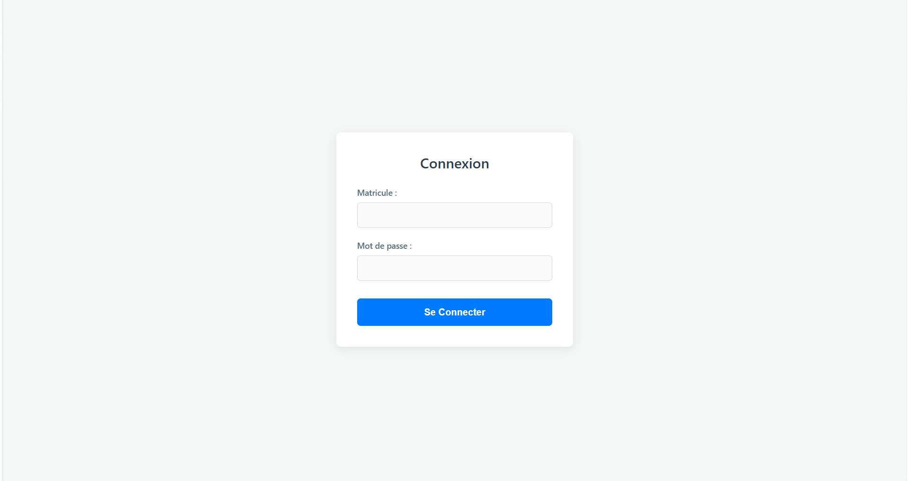
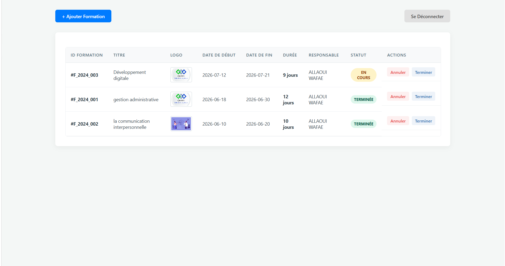
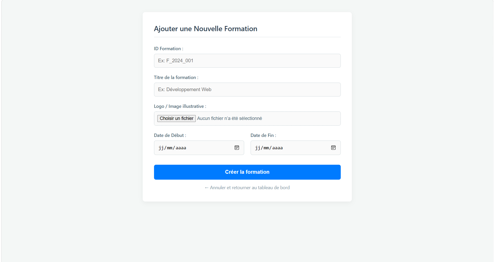

# Automated Training Session & Program Management Portal 🎓

A complete, full-stack enterprise web application tailored for educational institutions, corporate training hubs, or training centers (like ISTA). This system streamlines how educational coordinators schedule modules, track ongoing sessions, upload course materials, and monitor program lifecycles from initial kickoff to completion.

## 📁 System Architecture & Modules

### 1. 🔐 Secure Authentication Gateway
- **Features:** A clean, minimalist login gateway filtering coordinators and administrators by unique registration numbers (`Matricule`) and credentials.
- **Backend Security:** Implements robust server-side session management (`session_start()`) to protect inner routes and dashboards from unauthorized user access.
- **Data Protection:** Implements input sanitization and POST validation patterns to mitigate common web security vulnerabilities.

### 2. 📊 Dynamic Operations Dashboard (CRUD Matrix)
- **Features:** A centralized data repository interface displaying active relational tables, module tracking numbers, and coordinator logs.
- **UI Components:** Incorporates clean CSS layouts, live automated lifecycle tracking badges (`EN COURS` / `TERMINÉE`), and instant update workflow macros.

### 3. 📝 Module & Asset Registration Core
- **Features:** A semantic form core handling operational time intervals (Start/End dates) and active relational database injections.
- **Media Upload:** Integrated multi-part form parameter handlers (`enctype="multipart/form-data"`) supporting localized server uploads for visual course logos and branding banners.

## 🚀 Technologies Used
- **Backend Core:** PHP (Object-Oriented Logic, Session Tracking, & POST Handling)
- **Database Layer:** MySQL (Relational schemas, foreign key integrity, PDO exception tracking, and optimized CRUD queries)
- **Frontend Interactivity:** HTML5, CSS3, and JavaScript (Dynamic component viewport centering)

## 💻 Database Connection Setup
The application is pre-configured for instant deployment on localized servers (XAMPP, WampServer, Laragon). The database connection utilizes **PDO (PHP Data Objects)** with the following development parameters:
- **Database Name:** `gestionFormations`
- **Default User:** `root`
- **Port:** `3307` *(Can be adjusted to standard `3306` inside the configuration file depending on your local environment)*

---

## 📸 Application Layout & Screenshots

### 1. Authentication Gateway
Polished, minimalist layout for secure system access utilizing registration numbers.

### 2. Management Dashboard (CRUD Matrix)
The centralized data center featuring active relational tables, real-time lifecycle tracking badges, and workflow action triggers.

### 3. Module Registration Core
Structured validation form supporting native calendar interfaces and multi-part media uploads for visual logos.

